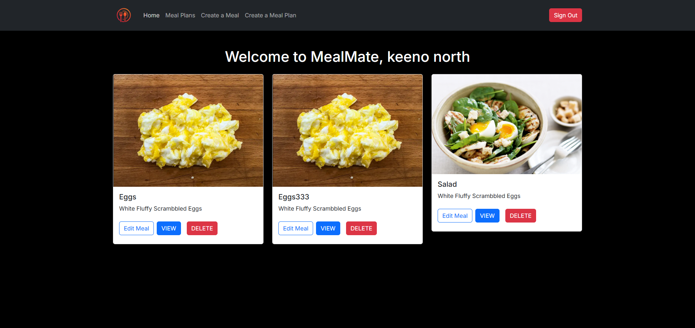
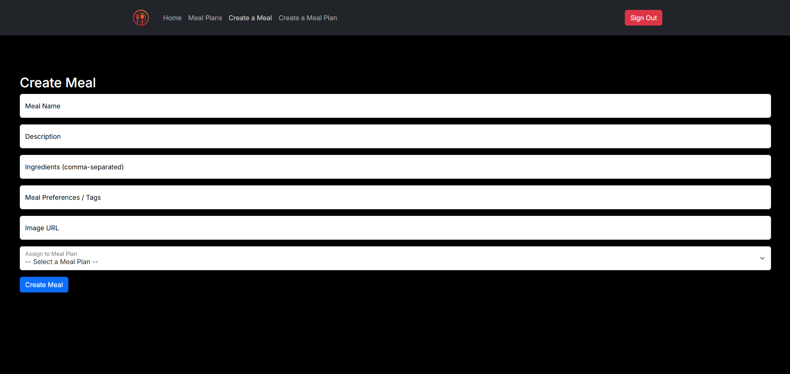
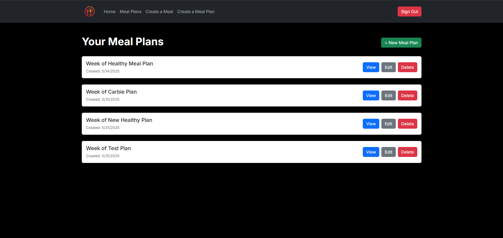
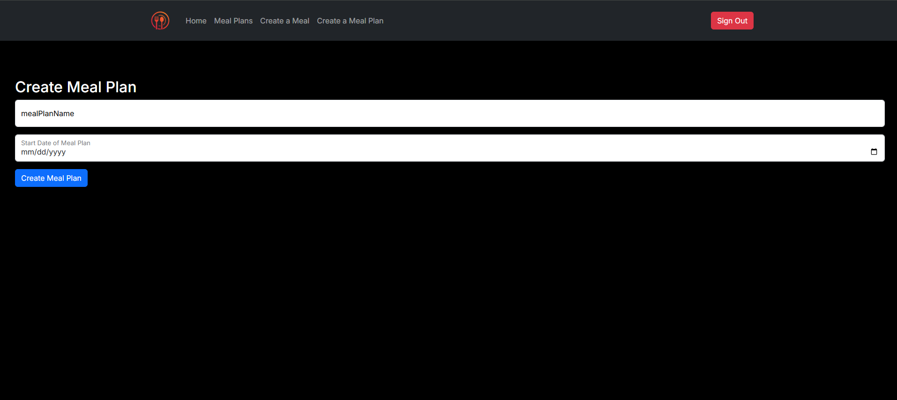
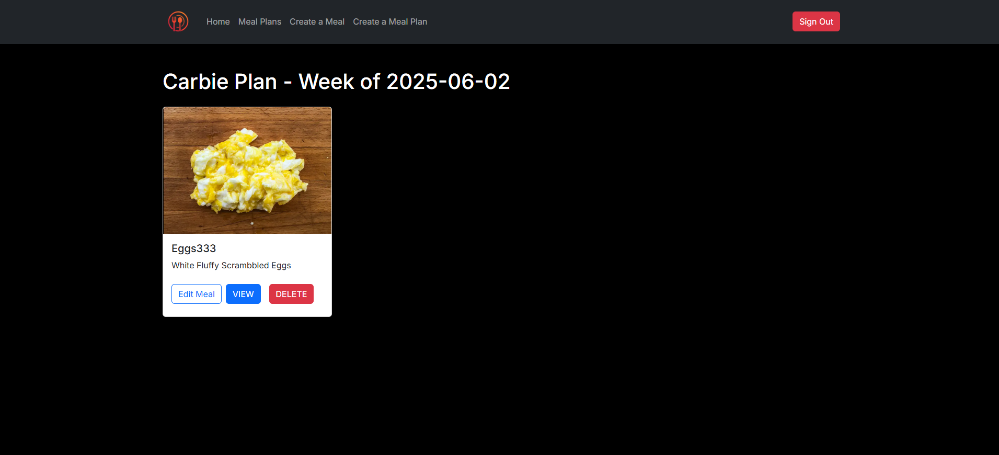
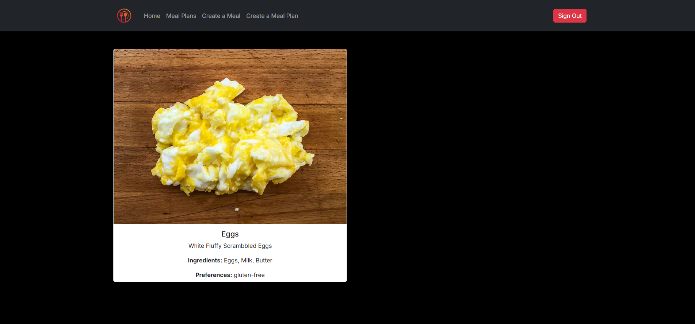

# MealMate 

## Overview

MealMate is a meal planning app that helps users easily organize their weekly meals based on their dietary preferences, time, and goals. Users can create and manage meals, assign them to weekly meal plans, and keep track of their meal planning history.

## Links

Wireframes: [https://www.figma.com/board/AvDOI4BRX2Zq9iRYtpp9Zz/Welcome-to-FigJam?node-id=0-1&t=aDd0u0LtQ5DOuSWE-1]
Netlify Deployed Project: [https://mealmate.netlify.app/]
Project Board: [https://github.com/users/mattnorthcutt/projects/4/views/1]

## User Desc

MealMate is designed for busy individuals who want to simplify meal planning. Whether you're managing a special diet, trying to save money, or just want to streamline your week, MealMate gives you a user-friendly way to plan, manage, and view your meals.

## Features

- User authentication with Firebase Auth
- Create / Read / Update / Delete Meals
- View all Meals in a user friendly layout
- Create Meal Plans with a start date and custom name
- Assign Meals to a Meal Plan
- View a Meal Plan and see all assigned Meals
- Responsive design using React Bootstrap

## Screenshots

### Home Page

### Meal Form

### Meal Plans Page

### Meal Plan Form

### Viewing a Meal Plan

### Viewing a Meal

## Loom Walkthrough
[https://www.loom.com/share/4cbb7b82a2aa45dca09a91e4506ccf3d]
